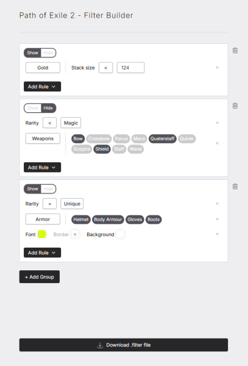

### Getting started

This filter builder is meant to help newer players of Path of Exile 2 create an item filter to be used in-game.



Each **Group** corresponds to a single item filter block:

```
Show
  BaseType == "Gold"
  SetTextColor 180 180 180
  SetBorderColor 0 0 0 255
  SetBackgroundColor 0 0 0 180
```

Each **Rule** generally corresponds to a row within the Group:

```
  SetTextColor 180 180 180
```

### Backlog

- more guardrails to prevent creating broken filter groups or rule combinations
- validate the file before download to clean-up redundant or broken filter groups.
- preconfigured example filters
- ability to import an existing .filter file
- modifiers for SoundEffects, FontSize, ~~Minimapicon~~
- extend Currency options for end-game content
- edge case handling (Bow vs Crossbow) / automatic reordering for specificity
- extend Rule options to include more Conditions from https://www.pathofexile.com/item-filter/about
- update data (Weapons) for upcoming game versions (1.0)

<sub>_This project is fan-made and not affiliated with Grinding Gear Games in any way._</sub>
